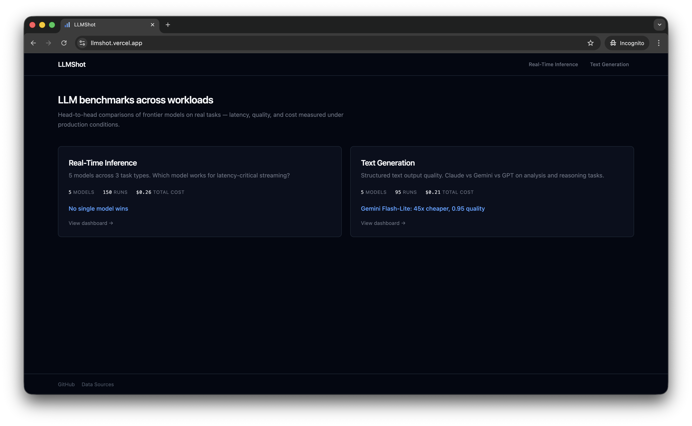

# LLMShot

[](https://github.com/berkayildi/llmshot/releases)
[](LICENSE)

**LLM performance · quality · cost analysis**

Multi-domain benchmark dashboard comparing LLM models across providers.

Live: [llmshot.vercel.app](https://llmshot.vercel.app)

## Role in ecosystem

LLMShot is the visualization layer. It fetches benchmark JSON from [llm-benchmarks](https://github.com/berkayildi/llm-benchmarks) (served via GitHub Pages) and renders three domain dashboards. It doesn't run benchmarks itself — those live in the producer repos ([mcp-llm-eval](https://github.com/berkayildi/mcp-llm-eval), [mcp-content-pipeline](https://github.com/berkayildi/mcp-content-pipeline), [meeting-agent](https://github.com/berkayildi/meeting-agent)).

Read-only by design. Auto-redeploys on every push to `llm-benchmarks/main` via Vercel.



## Domains

- **Real-Time Inference** (`/realtime`) — latency-critical streaming tasks across ADR, sprint planning, discovery.
- **Text Generation** (`/text-generation`) — structured text output quality, split into sub-benchmarks (Eval Gates, Content Pipeline).
- **Retrieval & RAG** (`/retrieval`) — BM25 baseline vs embedding-based retrieval over AWS documentation. Quality, citation faithfulness, and retrieval latency across 5 generation models and 4 retrievers.

## Data

Benchmark data lives in [llm-benchmarks](https://github.com/berkayildi/llm-benchmarks)
and is served via GitHub Pages at `https://berkayildi.github.io/llm-benchmarks/`.
See that repo for schema.

## Quick Start

```bash
make setup
make dev
```

Opens at [http://localhost:3000](http://localhost:3000).

## Development

```bash
make setup      # Install dependencies
make dev        # Run dev server at localhost:3000
make build      # Build production bundle
make preview    # Preview production build locally
make lint       # Run eslint
make clean      # Remove node_modules and dist
```

## Deployment

Deploy to [Vercel](https://vercel.com) via GitHub integration:

1. Import the repo at [vercel.com/new](https://vercel.com/new)
2. Vercel auto-detects config from `vercel.json` — no settings to change
3. Click **Deploy**

Every push to `main` triggers a production deployment. PRs get preview URLs.

## Tech Stack

- [React](https://react.dev) — UI framework
- [Vite](https://vite.dev) — build tool and dev server
- [Tailwind CSS](https://tailwindcss.com) — utility-first styling
- [Recharts](https://recharts.org) — charting library

## License

MIT
